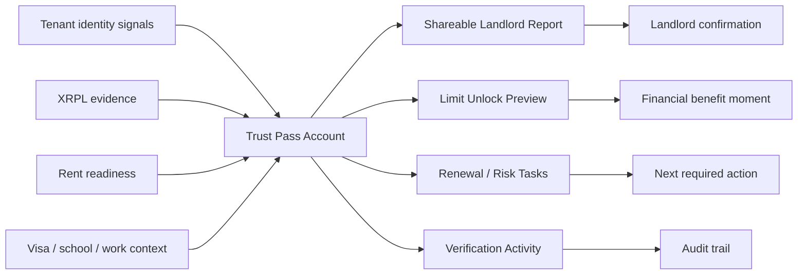
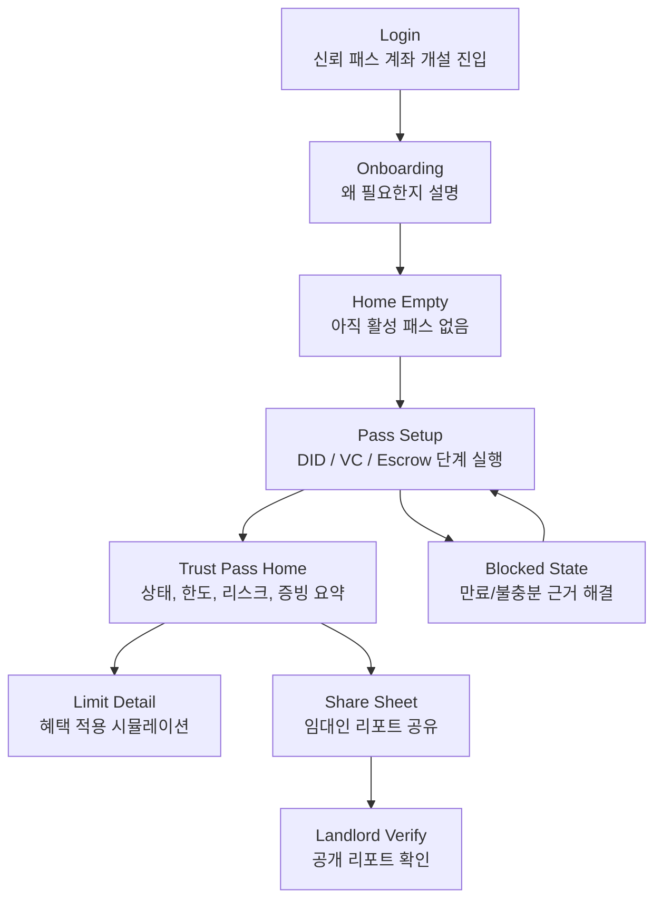
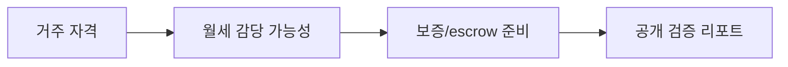
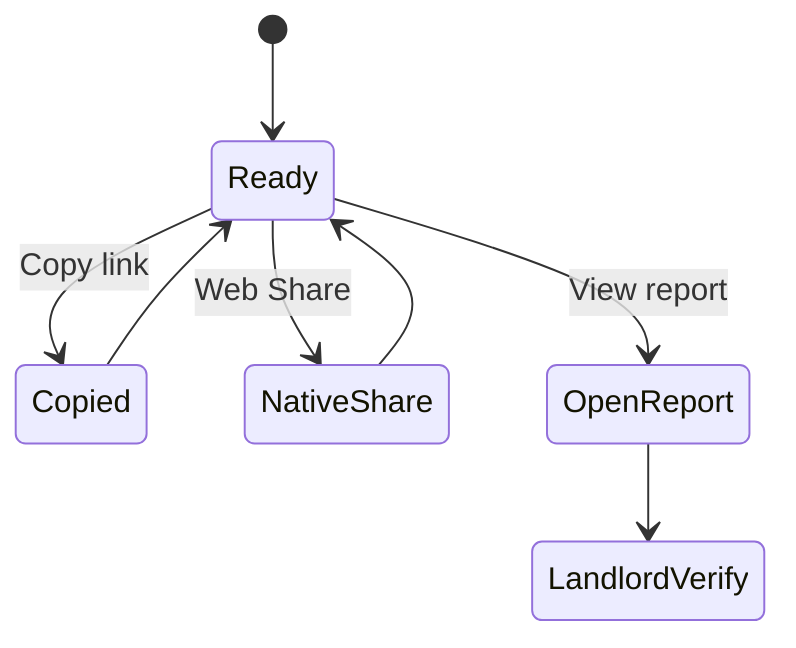
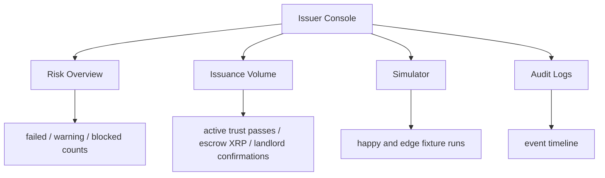
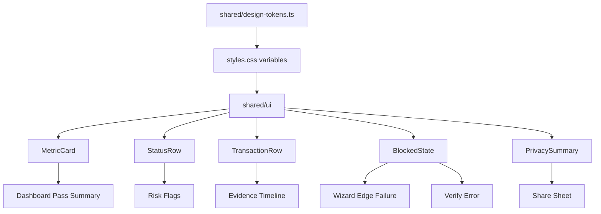

# 노목돈 금융앱 전환 구현 계획

작성일: 2026-05-14
대상: tenant 모바일 앱, landlord verify 앱, issuer console
목적: 단순 스타일 덮어쓰기가 아니라, 현재 신뢰 패스 MVP를 금융앱처럼 읽히는 정보 구조와 상호작용으로 전환한다.

## 0. 확인 범위와 제약

이번 점검에서 `npm run build`는 성공했다. 다만 현재 작업 환경에서는 로컬 포트 바인딩이 막혀 `npm run dev`와 `npm run server`가 각각 `127.0.0.1:5173`, `127.0.0.1:8787`에서 `EPERM`으로 실패했다. 따라서 실제 화면 관찰은 오늘 생성된 E2E 증거 이미지와 소스 구조를 함께 대조했다.

참조한 핵심 증거:

| 화면 | 증거 이미지 | 관찰 포인트 |
|---|---|---|
| 로그인 | `../../.sisyphus/evidence/happy/01-login.png` | 큰 히어로와 카드 중심. 금융앱 첫 화면보다는 랜딩 페이지에 가깝다. |
| 대시보드 | `../../.sisyphus/evidence/happy/07-dashboard.png` | 등급, unlock, DID, VC, 배지, 공유가 세로 카드로 나열된다. 계좌/한도 앱의 요약 위계가 약하다. |
| 한도 unlock | `../../.sisyphus/evidence/happy/08-toss-unlock.png` | 금융 혜택 순간은 있다. 하지만 상태 변화, 조건별 신뢰 근거, 다음 액션의 밀도가 부족하다. |
| 임대인 검증 | `../../.sisyphus/evidence/happy/10-verify-result.png` | 공개 리포트로 기능은 명확하다. 금융기관/심사자용 리포트처럼 위험 요약과 근거 레벨 구분이 더 필요하다. |
| 만료 비자 edge | `../../.sisyphus/evidence/edge/03-credential-failure.png` | 실패 경로가 안전하다. 금융앱다운 "막힌 이유와 해결 액션"으로 더 구조화할 수 있다. |

## 1. 현재 제품이 금융앱처럼 덜 보이는 이유

현재 UI의 문제는 색상이나 radius만의 문제가 아니다. 금융앱은 사용자가 첫 화면에서 "내 상태, 가능한 액션, 리스크, 증빙"을 즉시 판단하게 만든다. 현재 노목돈은 기능은 있으나 정보가 설명 카드로 분산되어 있어 금융앱 특유의 빠른 판단 구조가 약하다.

### 핵심 갭

| 영역 | 현재 | 금융앱 전환 방향 |
|---|---|---|
| 홈/대시보드 | 신뢰 등급 카드부터 긴 설명 카드가 이어짐 | 계좌 홈처럼 `신뢰 패스 상태`, `한도/혜택`, `리스크`, `최근 검증`을 한 화면 위계로 압축 |
| 신뢰 등급 | B 등급 자체는 보이나 산출 이유가 숨음 | 점수/등급을 `factor breakdown`, `risk flags`, `evidence freshness`로 분해 |
| 거래/증빙 | Explorer 링크가 카드 내부에 나열됨 | 금융앱의 거래내역처럼 `검증 타임라인`으로 보여줌 |
| CTA | `Try limit unlock`, `Copy link`, `View report`가 분리됨 | 상황별 primary action 하나와 보조 액션 2개로 정리 |
| 실패 경로 | error card + renewal guide | 대출/심사 앱처럼 `불가 사유`, `해결 필요 항목`, `재심사 가능 조건`으로 구조화 |
| 검증 리포트 | 임대인용 정보가 상세하지만 길다 | `요약 판정`, `주의 항목`, `검증 증거`, `확인 기록`으로 심사 리포트화 |
| 시각 밀도 | 큰 카드와 굵은 타이포 중심 | 리스트 row, status cell, segmented tab, compact surface로 반복 사용 앱 느낌 강화 |

## 2. 목표 제품 모델

노목돈은 "외국인 임차인의 주거 신뢰 패스"이지만 금융앱처럼 만들려면 화면의 중심을 `패스 생성`이 아니라 `신뢰 자산 관리`로 바꿔야 한다.



금융앱처럼 보이기 위한 핵심 명사는 다음으로 고정한다.

| 제품 명사 | UI 표현 |
|---|---|
| Trust Pass | 계좌/카드처럼 반복 진입하는 기본 자산 |
| Trust Grade | 신뢰 잔액 또는 신용 상태에 준하는 최상위 지표 |
| Unlock Limit | 혜택/한도 영역 |
| Risk Flags | 금융 심사에서 막히는 이유 |
| Evidence Timeline | 거래내역/증빙내역 |
| Share Report | 송금/공유에 해당하는 primary action |
| Renewal Tasks | 심사 보완 요청 |

## 3. 새 정보 구조

현재 tenant 앱 stage는 `login -> onboarding -> home -> wizard -> dashboard -> unlock`이다. 이 흐름은 유지하되, 화면의 의미를 다음처럼 바꾼다.



### Bottom tab 제안

지금은 화면별로 탭이 거의 하나뿐이라 모바일 앱으로서 반복 사용 구조가 약하다. 대시보드 진입 이후에는 최소 4개 탭을 제공한다.

```text
┌────────────────────────────────────┐
│ Trust Pass                         │
│ Mina P.                            │
├────────────────────────────────────┤
│ [Home] [Evidence] [Share] [More]   │
└────────────────────────────────────┘
```

| 탭 | 역할 | 현재 파일 영향 |
|---|---|---|
| Home | 등급, 한도, 리스크, 최근 활동 | `src/apps/tenant/screens/Dashboard.ts` |
| Evidence | DID, VC, Escrow, Explorer 링크 | 신규 `Evidence.ts` 또는 Dashboard 내부 분리 |
| Share | QR, link, Web Share, 최근 공유 상태 | Dashboard의 share panel 분리 |
| More | 언어, safety note, mock disclosure | `MobileShell`, 공통 설정 |

## 4. 화면별 구현 설계

### 4.1 로그인: 랜딩이 아니라 금융 계좌 진입처럼

현재 로그인 화면은 강한 마케팅 히어로에 가깝다. 금융앱 전환에서는 "신뢰 패스 계좌를 여는 첫 화면"으로 바꾼다.

```text
Before
┌──────────────────────────────┐
│ Find housing in Korea...     │
│ 설명 문장                    │
│ ┌ MOCK TOSS LOGIN 카드 ┐     │
│ │ bullet 3개           │     │
│ │ [Log in with Toss]   │     │
│ └──────────────────────┘     │
└──────────────────────────────┘

After
┌──────────────────────────────┐
│ NomokDon Trust Pass          │
│ 주거 심사용 신뢰 패스        │
│                              │
│ ┌ 패스 미리보기 ──────────┐  │
│ │ Grade --   Limit --     │  │
│ │ Evidence 0/6            │  │
│ └─────────────────────────┘  │
│ [Mock Toss로 시작하기]       │
│ 실제 인증/대출 아님 고지     │
└──────────────────────────────┘
```

구현 항목:

- `Login.ts`: hero copy를 계좌 개설형으로 바꾸고, bullet list 대신 미리보기 상태 카드 추가.
- `styles.css`: `tenant-login-hero`의 display headline을 줄이고, financial preview surface 추가.
- `i18n`: `tenantLoginCardTitle`, `tenantLoginCardCopy`, safety note 문구를 "mock financial preview" 톤으로 조정.

완료 기준:

- 첫 화면에서 "무엇을 만들고 어떤 상태가 비어 있는지"가 5초 안에 보인다.
- 공식 Toss 로고/상표 복제 없이 mock disclosure가 유지된다.

### 4.2 온보딩: 설명 슬라이드가 아니라 심사 기준 안내

현재 온보딩은 3개의 설명 카드다. 금융앱에서는 심사 기준을 미리 알려주는 checklist가 더 자연스럽다.



구현 항목:

- `Onboarding.ts`: step counter와 progress rail 추가.
- 각 step에 `필요한 데이터`, `공개되는 데이터`, `공개되지 않는 데이터`를 짧은 row로 제공.
- 마지막 step CTA는 `신뢰 패스 만들기`로 통일.

### 4.3 Home Empty: 신뢰 패스 없는 계좌 홈

현재 Home은 illustration + empty state이다. 금융앱처럼 만들려면 빈 상태도 `0원 계좌`처럼 구조가 있어야 한다.

```text
┌ Trust Pass Home ─────────────┐
│ 상태: 준비 전                │
│ 검증 배지 0/6                │
│ 공유 가능: 아니오            │
│                              │
│ 해야 할 일                   │
│ 1. DID 생성                  │
│ 2. 비자/월세 Credential      │
│ 3. Escrow 준비               │
│                              │
│ [신뢰 패스 만들기]           │
└──────────────────────────────┘
```

구현 항목:

- `Home.ts`: SVG illustration 중심에서 checklist 중심으로 변경.
- `Card` 대신 compact status surface와 task list row를 사용.
- `tenantHomeBadge*`는 pill 3개보다 `0/6` 진행 상태로 표현.

### 4.4 Wizard: 금융 심사 진행 화면으로 재구성

현재 Wizard는 데모 fixture selector와 3개 단계 카드가 세로로 나온다. 기능은 좋지만 금융앱의 심사 진행 화면처럼 "어디까지 통과했고, 왜 필요한지, 다음에 무엇을 누르는지"가 더 명확해야 한다.

```text
┌ Pass Setup ──────────────────┐
│ 진행률 2/3                   │
│ ● DID 생성       완료        │
│ ● Credential     진행 필요   │
│ ○ Escrow         대기        │
├ 현재 단계 ──────────────────┤
│ Credential 발급              │
│ Visa / Rent reputation       │
│ [Credential 발급 확인]       │
├ 증빙 미리보기 ───────────────┤
│ Visa CredentialCreate        │
│ Rent CredentialAccept        │
└──────────────────────────────┘
```

구현 항목:

- `Wizard.ts`: fixture selector는 개발/데모 모드로 접고, 기본 화면은 progress stepper 중심으로 정리.
- step card 내부에 `status`, `why it matters`, `evidence generated`를 row로 분리.
- 성공 후 Explorer links는 "거래 내역" row로 compact하게 보여준다.
- edge fixture 실패 화면은 아래 4.8과 같은 blocked state 컴포넌트로 통일.

### 4.5 Trust Pass Dashboard: 금융앱 전환의 핵심

현재 대시보드는 카드가 세로로 길게 이어진다. 핵심은 첫 viewport에 `상태 요약`, `가능한 혜택`, `리스크`, `주요 액션`이 모두 보여야 한다.

```text
┌ Trust Pass ──────────────────┐
│ Mina P.       Active         │
│                              │
│ Trust Grade                  │
│ B                            │
│ 5/6 passed · 1 warning       │
│ [리포트 공유] [한도 보기]    │
├ Limit preview ───────────────┤
│ +500만원 unlock 가능         │
│ 조건: 비자, 월세평판, escrow │
├ Risk flags ──────────────────┤
│ ! 납부이력 warning           │
├ Recent evidence ─────────────┤
│ DIDSet              완료     │
│ Visa Credential     완료     │
│ Rent Credential     완료     │
└ Bottom tabs ─────────────────┘
```

새 대시보드 구성:

| 섹션 | 구현 디테일 |
|---|---|
| Pass Summary | `Trust Grade B`, `5 pass / 1 warning`, `report active`, `generatedAt` |
| Limit Preview | `+KRW 5M`, 조건 3개, mock disclosure |
| Risk Flags | warning/fail badge만 모아서 보여줌. 모두 pass면 "No blocking risk" |
| Primary Actions | `리포트 공유`를 primary, `한도 보기`와 `증빙 보기`를 secondary |
| Evidence Timeline | DIDSet, CredentialCreate/Accept, EscrowCreate를 시간순 row로 표시 |
| Privacy Snapshot | 공개되는 것/비공개인 것 2열 요약 |

구현 항목:

- `Dashboard.ts`: `createTrustGradeCard`, `createUnlockCtaCard`, `createContextCard`, `createVcListCard`, `createBadgesCard`, `createSharePanel`을 그대로 나열하지 않고 `createPassSummary`, `createLimitPreview`, `createRiskFlags`, `createEvidenceTimeline`, `createShareSheet`로 재편.
- `DashboardBadge`에 `summary`나 `evidence`가 필요하면 서버 report badge 구조와 맞춰 타입 확장 검토.
- `ExplorerLink`는 카드형보다 transaction row variant를 추가.
- `MobileShell`에 4-tab 구조를 넣고 sticky nav가 본문을 가리지 않게 safe area padding 정리.

### 4.6 Limit Unlock: 혜택 화면이 아니라 심사 설명 화면

현재 unlock 화면은 어두운 카드가 강하게 들어가지만, 금융앱다운 설득은 "왜 +500만원이 가능한지"의 조건 분해에서 나온다.

```text
┌ Limit Detail ────────────────┐
│ 예상 unlock                  │
│ +500만원                     │
│ 실제 대출/신용조회 아님      │
├ 반영된 신호 ─────────────────┤
│ ✓ D-4 체류 맥락              │
│ ✓ 월세 평판 VC               │
│ ✓ Escrow 준비                │
├ 아직 약한 신호 ──────────────┤
│ ! 납부이력 warning           │
├ 다음 액션 ───────────────────┤
│ [임대인 리포트 공유]         │
└──────────────────────────────┘
```

구현 항목:

- `TossUnlock.ts`: signal stack을 pass/warning grouped list로 변경.
- 금액 hero 아래에 `calculation disclaimer`, `mock-only`, `no credit check`를 compact info banner로 제공.
- CTA를 `Back to dashboard`보다 `Share trust report` 중심으로 바꿀지 검토. 단, 실제 금융 API가 아니므로 "신청"처럼 오해되는 문구는 금지.

### 4.7 Share: 송금/공유 완료 흐름처럼

현재 share panel은 QR, Copy, View, Share가 한 카드에 있다. 금융앱에서는 공유 액션이 더 명확한 sheet 형태가 자연스럽다.



구현 항목:

- `createSharePanel`을 `ShareSheet` 컴포넌트로 분리.
- 공유 전 `공개 항목`과 `비공개 항목`을 한 줄 요약으로 보여준다.
- copy/share 성공 toast는 하단 탭과 겹치지 않게 위치 조정.

### 4.8 Blocked State: 실패 화면을 금융 심사 보완 요청처럼

현재 edge 화면은 안전하게 멈춘다. 여기에 금융앱의 "심사 보완" 구조를 적용한다.

```text
┌ Pass blocked ────────────────┐
│ Credential 발급 불가         │
│ 사유: 비자 만료              │
│ 만료일: 2024-02-01           │
├ 해결 필요 항목 ──────────────┤
│ 1. 갱신된 비자 근거 업로드   │
│ 2. 학교/고용 증빙 확인       │
│ 3. 재검증 실행               │
├ 생성되지 않은 것 ────────────┤
│ 공유 링크 없음               │
│ 검증 리포트 없음             │
│ Escrow 진행 없음             │
└ [다시 확인] ─────────────────┘
```

구현 항목:

- 공통 `BlockedState` UI를 `src/shared/ui`에 추가.
- `Wizard.ts`의 credential error와 `VerifyErrorScreen`의 report not found를 같은 패턴으로 정렬.
- 실패 화면에서 `Confirm escrow`나 공유 링크가 없다는 현 상태를 명시적으로 표시한다.

### 4.9 Landlord Verify: 심사 리포트로 압축

현재 검증 페이지는 데스크톱에서는 충분히 정보가 많지만, 금융기관 심사 리포트처럼 `판정 -> 주의 -> 근거 -> 확인` 순서가 더 낫다.

```text
┌ Verification Report ─────────┐
│ 결과: 확인 가능              │
│ Grade B · 5 pass · 1 warning │
├ Attention ───────────────────┤
│ ! 납부이력 warning           │
├ Badge details ───────────────┤
│ 비자유효 pass                │
│ 고용확인 pass                │
│ ...                          │
├ Public proofs ───────────────┤
│ XRPL transaction rows        │
├ Confirmation ────────────────┤
│ [확인했습니다] [PDF 저장]    │
└──────────────────────────────┘
```

구현 항목:

- `VerifyResult.ts`: `createGradeCard`와 `createTenantCard` 위에 `createVerdictSummary` 추가.
- warning/fail badge만 모은 `Attention` 섹션 추가.
- `verify-badge-grid`를 pass/warning/fail 순으로 정렬.
- confirmation card는 상단 summary와 하단 action 중복을 줄이고 sticky action 여부 검토.

### 4.10 Issuer Console: 운영자 대시보드도 금융 운영툴처럼

Issuer 화면은 사용자 금융앱은 아니지만, 전체 제품 신뢰도를 위해 운영 콘솔이 중요하다. 현재 logs/stats/simulator가 있으므로 다음처럼 정리한다.



구현 항목:

- `Stats.ts`: total count보다 `blocked`, `warning`, `confirmation conversion` 같은 심사 운영 지표 추가.
- `IssuerLogs.ts`: event type별 filter chip과 report id search 추가.
- `IssuerSimulator.ts`: happy/edge fixture 결과를 tenant blocked state와 같은 용어로 표시.

## 5. 디자인 시스템 전환 범위

Coinbase/Toss를 직접 복제하는 대신, 금융앱에서 검증된 패턴을 자체 토큰으로 흡수한다.

### 토큰 방향

| 토큰 | 현재 경향 | 변경 방향 |
|---|---|---|
| radius | 큰 카드 radius가 많음 | 큰 surface 20-24px, row/card 12-16px, button 14-16px로 계층화 |
| shadow | card shadow 의존 | shadow 줄이고 border/surface depth 중심 |
| typography | display가 매우 굵고 큼 | 금융 데이터 숫자 전용 `numeric` scale 추가 |
| color | 파란색 중심 | neutral surface + blue action + green pass + amber warning + red blocked |
| spacing | 카드 간 세로 간격 큼 | list row와 dense section 도입 |

구현 파일:

- `src/shared/design-tokens.ts`
- `src/styles.css`
- `src/shared/ui/card.ts`
- `src/shared/ui/badge.ts`
- `src/shared/ui/mobile-shell.ts`
- 신규 후보: `src/shared/ui/status-row.ts`, `src/shared/ui/metric-card.ts`, `src/shared/ui/transaction-row.ts`, `src/shared/ui/blocked-state.ts`

## 6. 단계별 구현 계획

### Phase 1: 금융앱 정보 위계 재정의

목표: 기능을 바꾸지 않고 대시보드 첫 viewport를 금융앱처럼 만든다.

작업:

- `Dashboard.ts`를 summary/risk/evidence/share 섹션으로 재구성.
- `styles.css`에 `trust-pass-summary`, `risk-flag-list`, `evidence-timeline`, `finance-action-row` 추가.
- `MobileShell`의 header가 본문 중간에 끼어 보이는 현상을 점검하고 sticky 위치를 정리.
- dashboard screenshot을 mobile 375px, desktop 1280px에서 재생성.

검증:

- `npm run build`
- `npm test`
- `npm run test:e2e:happy`
- `npm run test:e2e:edge`
- mobile screenshot에서 첫 viewport에 `Grade`, `limit`, `risk`, `share CTA`가 모두 보이는지 확인.

### Phase 2: Wizard와 blocked state 개선

목표: 패스 생성 과정을 금융 심사 진행 화면처럼 바꾼다.

작업:

- `Wizard.ts`에 progress stepper와 current-step detail 도입.
- edge error를 `BlockedState`로 추출.
- 만료 비자 화면에 "생성되지 않은 것" 목록 추가: dashboard, share link, verify report, escrow.
- fixture selector는 demo/debug surface로 시각적 우선순위를 낮춘다.

검증:

- edge E2E에서 `Confirm escrow`와 share link가 계속 없어야 한다.
- blocked state에서 retry가 기존 실패 조건을 우회하지 않는지 확인.

### Phase 3: Evidence와 Share를 금융앱 하위 탭으로 분리

목표: 대시보드를 긴 카드 나열에서 반복 사용 가능한 앱 구조로 바꾼다.

작업:

- `Dashboard.ts` 내부에 tab state를 추가하거나 `EvidenceScreen`, `ShareScreen`을 분리.
- `MobileShell` tabs를 Home/Evidence/Share/More로 확장.
- `ExplorerLink`의 transaction-row variant 추가.
- Share sheet에 공개/비공개 데이터 요약 추가.

검증:

- 탭 이동이 URL 없이 내부 상태로 충분한지, 아니면 hash route가 필요한지 확인.
- copy/share toast가 bottom nav와 겹치지 않는지 screenshot으로 확인.

### Phase 4: Verify report를 심사 리포트화

목표: 임대인이 보는 페이지를 금융 심사 리포트처럼 정리한다.

작업:

- `VerifyResult.ts`에 verdict summary 추가.
- warning/fail attention section 추가.
- badge order를 fail/warning/pass 또는 current product 우선순위로 정렬.
- PDF/print 레이아웃에 summary가 첫 페이지에 들어오도록 CSS 조정.

검증:

- `/verify/report_...`에서 localStorage에 tenant session이 남지 않아야 한다.
- reportId 외 민감 데이터가 URL/화면에 노출되지 않는 기존 E2E 조건 유지.

### Phase 5: Issuer 운영지표 정리

목표: 데모 심사관/운영자가 제품 안정성을 이해할 수 있게 한다.

작업:

- `Stats.ts`에 blocked count, warning count, confirmation conversion 추가.
- `IssuerLogs.ts`에 event filter와 report search 추가.
- `IssuerSimulator.ts` 결과를 tenant/verify 용어와 맞춘다.

검증:

- API logs가 없을 때 empty state가 깨지지 않아야 한다.
- simulator happy/edge 결과가 tenant wizard와 같은 상태 언어를 사용해야 한다.

## 7. 컴포넌트 구조 제안



신규 컴포넌트 후보:

| 컴포넌트 | Props | 사용처 |
|---|---|---|
| `MetricCard` | label, value, caption, status, action | Grade, limit, active pass count |
| `StatusRow` | icon, title, detail, status, trailing | risk flags, task checklist |
| `TransactionRow` | label, hash, network, href, status | XRPL evidence |
| `BlockedState` | title, reason, tasks, blockedOutputs, retry | expired visa, report not found |
| `PrivacySummary` | publicItems, privateItems | dashboard/share/verify |

## 8. 콘텐츠 톤 가이드

금융앱처럼 보이려면 문장도 설명형에서 상태형으로 바뀌어야 한다.

| 현재 톤 | 변경 톤 |
|---|---|
| "See a mock flow for how..." | "한도 미리보기 가능" |
| "Only public Testnet evidence..." | "공개 증빙 6개" |
| "The report shares exactly six badges..." | "공유 항목: 배지 6개, reportId, XRPL 링크" |
| "Credential issuance is stopped..." | "발급 중단: 비자 만료" |

원칙:

- headline은 설명이 아니라 상태를 말한다.
- 긴 설명은 info banner나 detail sheet로 내린다.
- mock/safety disclosure는 숨기지 않되, primary action보다 시각적으로 커지지 않게 한다.
- "대출 신청", "승인", "심사 통과"처럼 실제 금융 행위로 오해될 수 있는 표현은 피한다.

## 9. 리스크와 주의점

| 리스크 | 대응 |
|---|---|
| Toss/Coinbase를 그대로 복제했다는 인상 | 공식 로고, 고유 컴포넌트 명칭, 브랜드 색상 조합 직접 복제 금지. 자체 NomokDon 토큰으로 구현 |
| 실제 대출/신용조회처럼 오해 | 모든 limit 화면에 mock-only, no credit check, no external financial API 고지 유지 |
| 카드 줄이기 과정에서 증빙 정보가 숨음 | evidence tab과 transaction row로 상세 접근성 유지 |
| dashboard 타입이 Verify report 타입과 중복 | badge/report 타입을 공유 가능한 domain type으로 옮길지 검토 |
| E2E locator 깨짐 | 버튼 accessible name은 기존 테스트와 호환되게 유지하거나 테스트를 함께 업데이트 |

## 10. 우선순위 결론

가장 먼저 할 일은 색상 변경이 아니라 `Dashboard.ts` 재구성이다. 현재 제품의 핵심 가치는 이미 `Trust Grade`, `6 badges`, `XRPL evidence`, `share report`, `limit unlock`에 있다. 이걸 금융앱처럼 보이게 하려면 첫 화면에 다음 네 가지가 동시에 보여야 한다.

```text
1. 나는 지금 어떤 상태인가?       -> Trust Grade B / Active
2. 무엇을 할 수 있는가?           -> Share report / View limit
3. 무엇이 위험한가?               -> 1 warning / no blocking issue
4. 어떤 근거가 있는가?            -> DID, VC, Escrow timeline
```

권장 실행 순서:

1. Phase 1 대시보드 정보 구조 전환
2. Phase 2 Wizard blocked state 정리
3. Phase 3 Evidence/Share 탭 분리
4. Phase 4 Verify report 심사 리포트화
5. Phase 5 Issuer 운영지표 개선

이 순서가 해커톤 데모에 가장 효율적이다. 첫 번째 단계만 완료해도 "금융앱처럼 보이는가"의 체감이 크게 바뀌고, 이후 단계는 제품 신뢰도와 심사 흐름의 완성도를 높인다.
