# 🎯 토스 특별상 수상 전략 — 심사 포인트 & 아이디어 방향

---

## 1. 토스팀이 가장 중요하게 볼 내용

토스 특별상의 심사 기준 5가지를 가중치 순으로 분석합니다.

### 🔴 최우선 (가중치 높음)

| 기준 | 토스가 정말 원하는 것 | 근거 |
|------|---------------------|------|
| **⑤ 토스 시너지** | "App in Toss"에 실제로 탑재할 수 있는가 | 비금전적 혜택에 "App in Toss 탑재 논의 기회"를 명시. **토스 내부에서 실제로 쓸 수 있는 서비스**를 찾고 있음 |
| **① 문제 정의** | 재한 외국인 250만명의 **구체적 pain point** | "복잡한 KYC, 높은 수수료, 신용이력 부족, 정보 비대칭, 체류자격 연계 부재"를 직접 나열 |

### 🟡 중요 (가중치 중간)

| 기준 | 토스가 보는 포인트 | 근거 |
|------|------------------|------|
| **③ 실현 가능성** | 한국 금융 규제를 알고 있는가 | "규제 및 법적 이슈를 충분히 고려했는가" 명시. 토스는 규제 지뢰밭을 잘 아는 팀을 원함 |
| **② XRPL 활용** | XRPL이 왜 필요한지 설명 가능한가 | "단순 적용을 넘어, 블록체인 활용의 필요성이 분명한가" — DB로도 되는 거 아닌가? 에 답할 수 있어야 |

### 🟢 부가 (가중치 낮음)

| 기준 | 포인트 |
|------|--------|
| **④ 확장성** | 외국인 금융 → 글로벌 확장 가능성. 있으면 좋지만 핵심은 아님 |

> [!TIP]
> ### 토스팀의 숨은 의도
> 토스는 **"PoC 협의 기회"와 "App in Toss 탑재"**를 혜택으로 내걸었습니다.
> 이는 단순히 잘 만든 프로젝트가 아니라, **토스 플랫폼에 실제로 통합할 수 있는 모듈/API**를 원한다는 뜻입니다.
>
> **핵심 질문**: "이 서비스를 토스 앱 안에 넣었을 때, 외국인 사용자 경험이 어떻게 개선되는가?"

---

## 2. XRP팀(XRPL Korea)이 가장 중요하게 볼 내용

### XRP팀의 평가 관점

| 포인트 | 설명 |
|--------|------|
| **XRPL 네이티브 기능 활용 깊이** | Credential, Escrow, AMM, DID, NFT, TrustLine 등 얼마나 다양하게 쓰는가 |
| **"왜 XRPL이어야 하는가"** | 이더리움이나 솔라나가 아닌 XRPL을 선택한 이유가 설득력 있는가 |
| **XRPL 생태계 기여** | 새로운 사용자를 XRPL로 유입시키는가. 생태계 확장에 기여하는가 |
| **기술적 구현 수준** | Testnet 증거, 로컬 데모 완성도, 실제 트랜잭션 검증 |

> [!IMPORTANT]
> ### XRP팀과 토스팀의 교차점
> 둘 다 원하는 것: **"재한 외국인"을 위해 XRPL의 고유 기능을 잘 활용하는, 실현 가능한 서비스**
>
> - 토스: "우리 플랫폼에 탑재 가능한가?"
> - XRP: "XRPL이 왜 최선의 선택인가?"
>
> → **두 질문에 동시에 답하는 아이디어가 우승합니다.**

---

## 3. 추천 아이디어 방향

### 안 A: 🏆 **외국인 금융 포트폴리오 Credential** (CredBundle 직접 대항마)

> "재한 외국인이 한국에서의 금융 활동 전체를 하나의 XRPL Credential로 증명"

| 항목 | 내용 |
|------|------|
| **핵심 컨셉** | 체류자격 + 소득 + 납세 + 건강보험 + 한국 내 소비/결제 이력 → **Financial Life Credential** 발급 |
| **CredBundle과의 차별점** | CredBundle은 "대출 심사 통과"에 집중. 우리는 **금융생활 전반**(대출/보험/주거/통신/결제)의 원스톱 증명으로 확장 |
| **XRPL 활용** | `CredentialCreate` (자격증명), `DIDSet` (신원), `DepositPreauth` (서비스 접근제어), `TrustLine` (리워드 토큰) |
| **토스 시너지** | 토스 앱 내에서 외국인이 "내 금융 Credential" 확인 + 연동 금융상품 추천. "토스 외국인 모드" API 모듈 |
| **왜 XRPL?** | Credential이 프로토콜 네이티브 → 스마트 컨트랙트 취약점 없음. 크로스보더 검증 가능(본국에서도 유효) |
| **리스크** | CredBundle과 정면 경쟁. 차별화 포인트를 더 날카롭게 만들어야 함 |

### 안 B: 🔵 **외국인 근로자 급여 + 실시간 송금 허브** (블루오션)

> "외국인 근로자 급여를 XRPL로 수령 → 자동 환전 → 본국 실시간 송금 + 한국 내 소비"

| 항목 | 내용 |
|------|------|
| **핵심 컨셉** | 고용주가 XRPL 기반으로 외국인 근로자에게 급여 정산 → 근로자가 원하는 비율로 본국 송금 / 한국 소비 분배 |
| **타겟** | 한국 제조업/서비스업 외국인 근로자 (약 80만명) + 고용주 |
| **XRPL 활용** | `Cross-Currency Payment` (자동 환전), `Escrow` (급여 예치), `TrustLine` (다통화 잔고), `PaymentChannel` (소액 반복 송금) |
| **토스 시너지** | "토스 해외송금"과 직접 연동. 외국인 근로자 급여 관리 탭으로 App in Toss 가능 |
| **왜 XRPL?** | 크로스보더 결제가 XRPL의 **존재 이유**. 3~5초 결제 완결성 + 0.00001 XRP 수수료 |
| **차별점** | 기존 경쟁자 중 **급여 정산 + 실시간 송금** 조합은 없음. 고용주도 같이 온보딩하는 B2B2C 모델 |

### 안 C: 🟢 **외국인 체류자격 연동 스마트 금융** (가장 독창적)

> "비자 상태가 바뀌면 금융 서비스가 자동으로 조정되는 XRPL 기반 금융 자동화"

| 항목 | 내용 |
|------|------|
| **핵심 컨셉** | 체류자격(E-9, D-10, F-2 등) 변경 시 → XRPL Credential 자동 갱신 → 연동 금융상품 자동 조정 |
| **예시** | E-9(비전문취업) → F-2(거주) 변경 시: 대출 한도↑, 보험 상품 변경, 투자 가능 상품 확장 자동 반영 |
| **XRPL 활용** | `Credential` (체류자격 증명 + 자동 갱신/만료), `DepositPreauth` (체류자격별 금융 접근 자동 제어), `DIDSet` (신원 관리), `Hook` (조건부 자동 실행) |
| **토스 시너지** | "토스 외국인 센터"에서 비자 변경 알림 → 금융상품 자동 추천/갱신. 이민정책 변화에 실시간 대응 |
| **왜 XRPL?** | Credential 만료(Expiration) 기능이 프로토콜 네이티브 → 비자 만료와 자연스럽게 연동 |
| **차별점** | 토스 특별상 예시 "비자·체류 자격과 연동된 금융 자동화 서비스"를 **정면으로 타격** |

---

### 안별 비교

| 평가 기준 | 안 A (Credential 대항마) | 안 B (급여+송금) | 안 C (비자 연동 자동화) |
|-----------|----------------------|----------------|---------------------|
| 문제 정의 명확성 | ⭐⭐⭐⭐ | ⭐⭐⭐⭐⭐ | ⭐⭐⭐⭐⭐ |
| XRPL 활용도 | ⭐⭐⭐⭐ | ⭐⭐⭐⭐⭐ | ⭐⭐⭐⭐⭐ |
| 실현 가능성 | ⭐⭐⭐ | ⭐⭐⭐⭐ | ⭐⭐⭐ |
| 확장성/임팩트 | ⭐⭐⭐⭐ | ⭐⭐⭐⭐⭐ | ⭐⭐⭐⭐ |
| 토스 시너지 | ⭐⭐⭐⭐ | ⭐⭐⭐⭐⭐ | ⭐⭐⭐⭐⭐ |
| CredBundle과 차별화 | ⭐⭐ | ⭐⭐⭐⭐⭐ | ⭐⭐⭐⭐⭐ |
| **경쟁 공백** | 🔴 3팀 경쟁 | 🔵 **블루오션** | 🔵 **블루오션** |

> [!IMPORTANT]
> ### 추천: **안 B + 안 C 하이브리드**
>
> **"외국인 근로자 급여 실시간 정산 + 비자 연동 자동 금융 서비스"**
>
> - 고용주가 급여를 XRPL로 정산 → 근로자가 본국 송금/한국 소비 분배
> - 비자 상태 변경 시 금융 서비스 자동 조정
> - XRPL: Cross-Currency Payment + Escrow + Credential + DepositPreauth
> - 토스: 해외송금 + 외국인 뱅킹 연동
>
> **CredBundle/Xfer와 직접 경쟁하지 않으면서, 토스 특별상 예시 영역 4개를 동시 커버합니다.**

---

## 4. 분야별 겹침 매트릭스

### 카테고리별 경쟁 밀도

```mermaid
graph TD
    A["Credential/신원 검증<br/>🔴 3팀"] --> A1["#1 SBT+"]
    A --> A2["#12 KYvC"]
    A --> A3["#13 CredBundle"]
    
    B["결제/정산<br/>🔴 4팀"] --> B1["#2 Fleet Settlement"]
    B --> B2["#4 Xfer"]
    B --> B3["#5 무역대금"]
    B --> B4["#16 GG Banking"]
    
    C["DeFi/투자<br/>🟡 4팀"] --> C1["#6 SIVAX"]
    C --> C2["#8 reCEPTION"]
    C --> C3["#17 달러파킹"]
    C --> C4["#18 Billycash"]
    
    D["RWA/NFT<br/>🟡 3팀"] --> D1["#7 BlueLog"]
    D --> D2["#9 Truve"]
    D --> D3["#11 Blue Nomad"]
    
    E["AI+금융<br/>🟢 2팀"] --> E1["#10 Unveil Protocol"]
    E --> E2["#15 Feelconomic"]
    
    F["시니어/보호<br/>🟢 1팀"] --> F1["#3 가디언월렛"]
    
    G["밋업/소셜<br/>🟢 1팀"] --> G1["#19 HI-DORRI"]
    
    H["DePIN<br/>🟢 1팀"] --> H1["#14 에어벤트"]
    
    I["GEO/마케팅<br/>🟢 1팀"] --> I1["#20 GEO Gateway"]
```

### 기술 스택 겹침

| XRPL 기능 | 사용 팀 수 | 팀 목록 |
|-----------|-----------|---------|
| **Credential/VC/DID** | 4팀 | SBT#+, KYvC, CredBundle, (Unveil) |
| **Cross-Currency Payment** | 3팀 | Xfer, GG Banking, HI-DORRI |
| **Escrow** | 2팀 | HI-DORRI, (안 B) |
| **NFT (XLS-20)** | 3팀 | BlueLog, Truve, HI-DORRI |
| **TrustLine/IOU** | 3팀 | Billycash, HI-DORRI, Blue Nomad |
| **AMM/DEX** | 2팀 | SIVAX, GG Banking |
| **MultiSign** | 1팀 | 가디언월렛 |
| **DepositPreauth** | 1팀 | SBT#+ |
| **PaymentChannel** | 0팀 | **아무도 안 씀** |
| **Hook (스마트 컨트랙트)** | 0팀 | **아무도 안 씀** |

> [!TIP]
> ### 기술 차별화 기회
> **PaymentChannel**과 **Hook**을 활용하면 기술적으로 유일한 팀이 됩니다.
> - PaymentChannel: 외국인 근로자 소액 반복 송금에 최적
> - Hook: 비자 상태 변경 시 금융 서비스 자동 조정에 활용 가능

### "재한 외국인" 직접 타겟 팀

| 팀 | 외국인 세부 타겟 | 해결하는 pain point |
|-----|----------------|-------------------|
| **#13 CredBundle** | 재한 외국인 전체 | 대출 심사 통과 |
| **#4 Xfer** | 유학생 | 송금·환전·소비증빙 |
| **#12 KYvC** | 외국인 법인 (간접) | KYC 자동화 |
| *나머지 17팀* | *외국인 타겟 아님* | — |

> [!CAUTION]
> **외국인 금융을 직접 타겟하는 팀이 3팀뿐**이라는 것은 기회입니다.
> 하지만 CredBundle이 이미 토스뱅크를 명시적으로 언급하고 있어, **차별화된 각도**로 접근해야 합니다.
